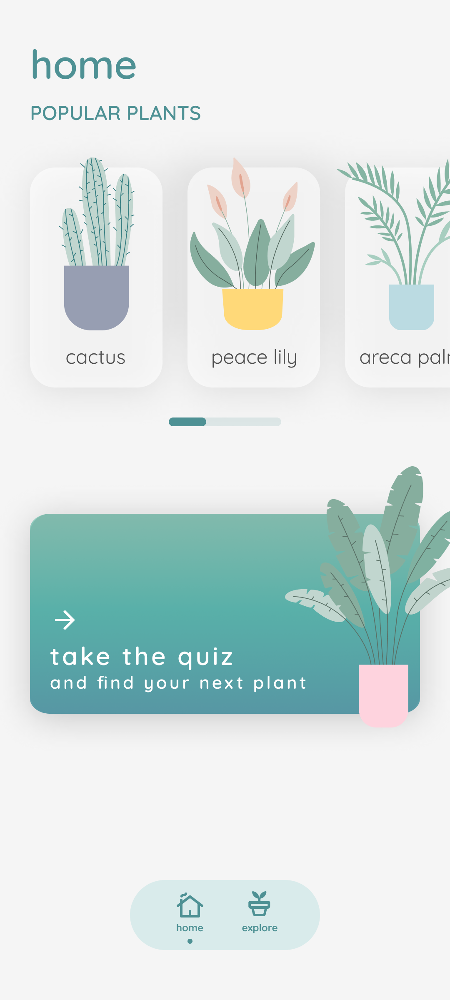
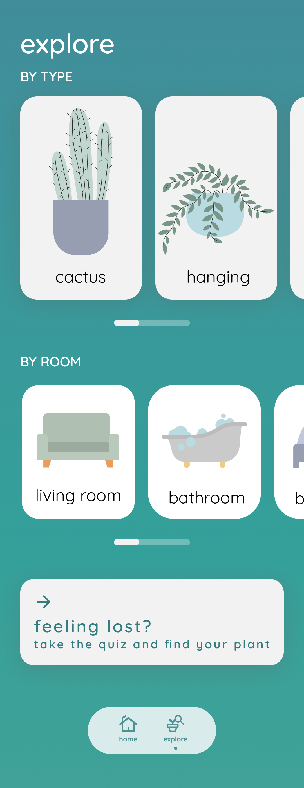
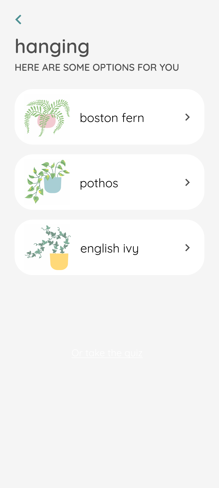
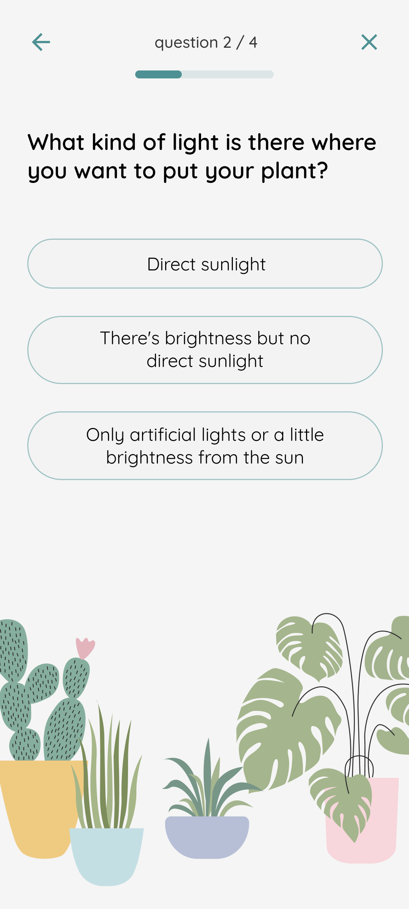

# PlantLady

### On App Store
https://play.google.com/store/apps/details?id=br.com.ladyplant

|                    Home                    |                     Explore                      |                         Result                         |                        Detail                         |                    Quiz                     |
|:------------------------------------------:|:------------------------------------------------:|:------------------------------------------------------:|:-----------------------------------------------------:|:-------------------------------------------:|
|  |  |  |  |  |

## About the code

### 🏗️ Why MVVM
- Separation of concerns: MVVM separates the user interface from the business logic and data access, allowing each component to focus on its specific responsibility. This separation makes it easier to test and modify individual components without affecting the others.
- Testability: By separating the user interface from the business logic and data access, it becomes easier to test each component in isolation. ViewModel, for example, can be tested without involving the UI or the database.
- Scalability: MVVM provides a modular structure that makes it easy to add new features and modify existing ones without affecting the rest of the app.
- Maintainability: By separating the UI from the business logic and data access, the code becomes easier to understand and maintain. Changes to one component are less likely to cause unintended side effects in other parts of the app.
- Reusability: MVVM promotes the use of reusable components such as ViewModels, which can be shared across different screens or even different apps.

### 🧼 Clean Architecture

Clean Architecture helps to achieve separation of concerns and maintainability. It consists of several layers of abstraction, each with its own responsibilities, and it aims to isolate the business logic from the details of the infrastructure.

When applying Clean Architecture to an Android app, it's common to divide the codebase into three modules: App, Domain, and Repository.

- App module: This module contains the UI code, including the Activities and Compose Views, as well as the presentation logic, such as ViewModels and Presenters. This module is responsible for displaying the data to the user and handling the user's input.
- Domain module: This module contains the business logic of the app, such as use cases and domain models. The use cases represent the actions that the user can perform in the app, and they orchestrate the interactions between the app and the repository. The domain models represent the entities and concepts that are specific to the app's domain.
- Repository module: This module contains the code that interacts with the data sources, such as databases, APIs, and local storage. It's responsible for fetching the data from the sources and storing it in a format that's convenient for the app to use. The repository module abstracts away the details of the data sources and provides a clean interface for the domain layer to interact with.
 
By separating the app into these three modules, it becomes easier to maintain and evolve the app over time. Each module has its own responsibilities and concerns, and the dependencies between the modules are well-defined. This makes it easier to test each module in isolation, and it also enables teams to work on different parts of the app in parallel.

### ⚙️ Coroutines over RxJava/RxKotlin
Coroutines provide a simpler, more efficient, and more integrated approach to asynchronous programming compared to RxJava/RxKotlin. While RxJava/RxKotlin have their own advantages and use cases, Coroutines are becoming increasingly popular among Android developers due to their ease of use and seamless integration with Kotlin.

### 📲 Compose?
Jetpack Compose is designed to be a more modern and efficient approach to UI development compared to traditional XML-based layouts. Here are some reasons I took in considerationg in order to use Jetpack Compose for Android development:

- Kotlin first: Jetpack Compose is built with Kotlin and leverages Kotlin's language features and syntax, which makes it more intuitive and seamless to integrate with Kotlin-based Android apps. It also enables more concise and expressive code.
- Faster development: Jetpack Compose can accelerate the UI development process by providing a more efficient workflow for building and testing UI components. The instant preview feature, for example, allows developers to see the UI changes in real-time without needing to run the app.
- Declarative UI: Jetpack Compose uses a declarative approach to UI development, which means that you describe the UI elements and their properties in code, rather than using XML layouts. This can make the code more readable, maintainable, and easier to understand for developers who are familiar with modern frontend frameworks like React or SwiftUI.
- Modular and reusable components: Jetpack Compose promotes the use of modular and reusable UI components, which can simplify the UI development process and reduce the amount of code needed to build complex UIs. It also enables easier collaboration between designers and developers.
- Enhanced performance: Jetpack Compose is optimized for performance and can offer better UI rendering performance and smoother animations compared to traditional XML-based layouts.
- Backward compatibility: Jetpack Compose is designed to be compatible with older Android versions, allowing developers to use it in apps targeting Android API level 21 or higher. It also provides compatibility with existing Android views and layout libraries.
- Active community: Jetpack Compose is backed by a vibrant and active community of developers and contributors, who provide resources, support, and best practices for using the toolkit effectively.

### 💉 Definitely Hilt as Dependency Injection!

- Simplifies dependency injection: Hilt provides a set of annotations and tools that make it easy to inject dependencies into your app's classes without having to write boilerplate code.
- Integrates with other Jetpack libraries: Hilt is designed to work seamlessly with other Jetpack libraries, such as ViewModel and Room, making it easy to implement best practices for Android app development.
- Generates less code: Hilt generates less code compared to other dependency injection frameworks like Dagger, which can reduce the amount of code you need to write and maintain.
- Supports multiple scopes: Hilt supports different scopes, such as singleton, activity, fragment, and view models, which can help you manage the lifecycle of your app's components more effectively.
- Provides compile-time safety: Hilt provides compile-time safety checks, which can help you catch errors early in the development process and avoid runtime issues.
- Enables testing: Hilt makes it easy to test your app's classes by providing tools for mocking dependencies and injecting them into your tests.
- Backed by Google: Hilt is an official Google library, which means it's actively maintained and supported by the Android team. It also means you can expect it to be integrated with future Android updates and improvements.
